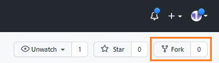
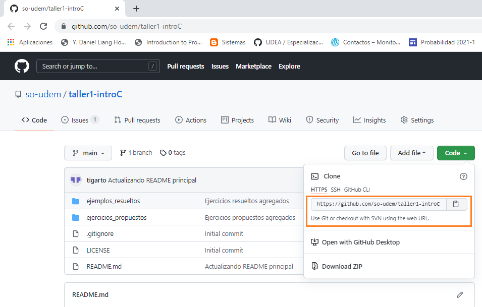

# Taller de repaso

## Instrucciones

### Organizando el entorno de trabajo

1. Siguiento las instrucciones dadas en [GitHub. Crear cuenta](https://www.mclibre.org/consultar/informatica/lecciones/github-cuenta.html) crear una cuenta en github.
2. Una vez haya creado su cuenta en github y habiendose logueado en esta, acceda al repositorio https://github.com/so-udem/taller1-introC y realice una operación de fork tal y como se muestra en la siguiente figura:




3. En la ventana que se despliega seleccione su cuenta. Una vez hecho esto, este repositorio se copiará en sus repotorios.

4. Tal y como se mostro en clase y siguiento las instrucciones dadas en [git - la guía sencilla](http://rogerdudler.github.io/git-guide/index.es.html) clone el repositorio recien copiado en su cuenta a su maquina local, tal y como se muestra en la siguiente figura:
   


5. Una vez hecho esto, la dirección del repositorio se compiará en el clipboard. Luego, ubicandose en el directorio donde usted va a trabajar clone el repo anterior para que pueda realizar la solución de los ejercicios propuestos en su maquina. A continuación se resumen comandos a ejecutar:

```
git clone DIR_REPO
cd taller1-introC
ls
```

* **Nota**: Tenga en cuenta que DIR_REPO, es la dirección que se obtuvo al realizar el paso 4. Si todo esta bien, se deberá haber creado un directorio llamado **taller1-introC** el cual contiene una copia del contenido del repo que se encuentra en github.

6. Una vez dentro del repo, realizar la configuración inicial de este asociando su cuenta de github y su email al aplicar los siguientes comandos:

```
git config --global user.name "usuario_github"
git config --global user.email email_registrado
```

7. ingrese al directorio ejercicios propuestos y resuelva todos los ejercicios que alli se encuentran siguiendo las instrucciones que alli se muestran y que se explicaron en clase.

### Desarrollo de la actividad

El directorio **ejercicios_propuestos** contiene una lista de ejercicios propuestos divididos en 2 partes. El objetivo es que usted resuelva cada uno de estos y una vez que tenga su solución los suba en su repositorio. Para ello siga la siguiente nomenclatura:

```parteY_ejerX.c```

Donde:
* **Y**: Parte a la cual pertenece el ejercicio. En este caso Y puede ser 1 o 2.
* **X**: Numero del ejercicio.

Por ejemplo, siguiendo la nomenclatura anterior, el nombre del ejercicio 10 de la parte 1 se deberá llamar **parte1_ejer10.c**.

Para subir la solución de este ejercicio, usted puede ejecutar los siguiente comandos:

```
git add parte1_ejer10.c
git commit -m "mensaje explicativo"
git push 
```

Si todo esta bien, el archivo **parte1_ejer10.c** deberá aparecer en su repositorio.

## Material de utilidad

1. **Ejercicios resueltos**: En el directorio **ejemplos_resueltos** ([link online](https://github.com/so-udem/taller1-introC/tree/main/ejemplos_resueltos)), se encuentran varios ejercicios cuyo analisis le puede ser de utilidad para la solución de la actividad.
2. **Ejercicios de clases**: En el link [codigos_clases](https://github.com/so-udem/codigos_clases) se encuentran los ejemplos realizados en clases.

Si tiene alguna duda, puede escribir en el foro en moodle o solicitar asesoria.


